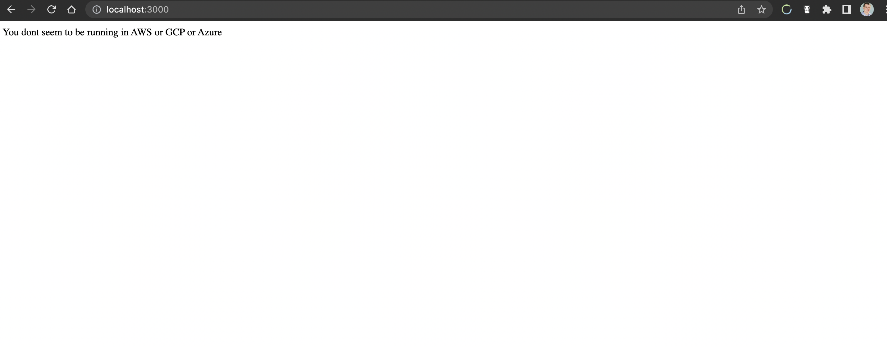
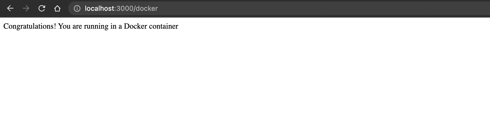
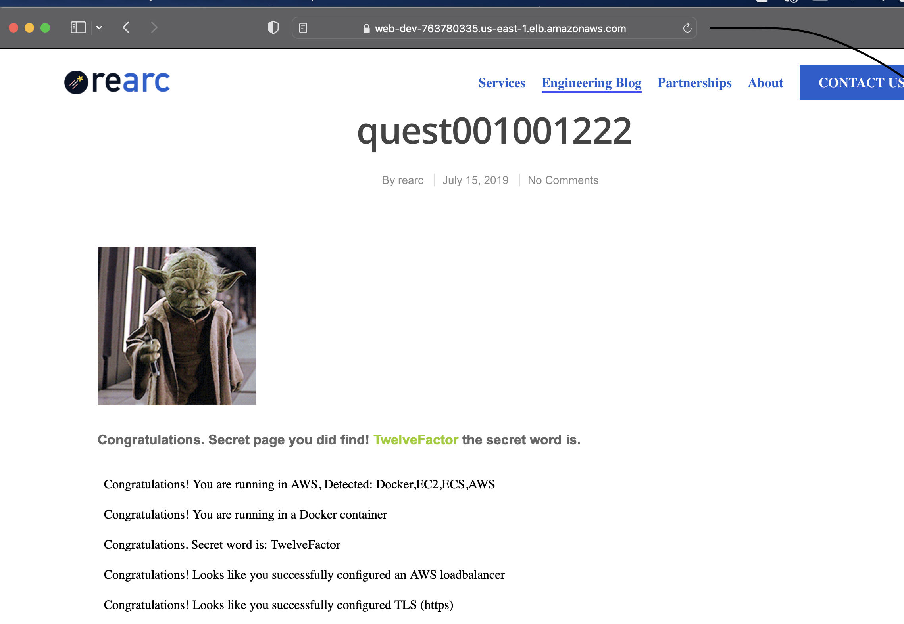
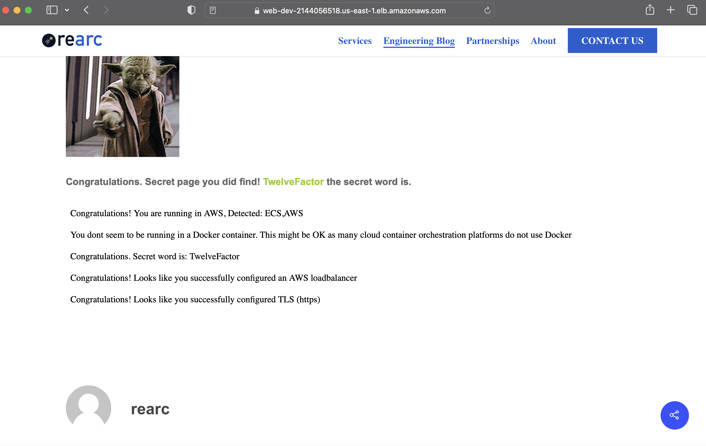

# Quest App Excercise
Cloud Quest Excercise to deploy node.js App to AWS

## Local Docker Deployment
- After downloading the repo a file Dockerfile was made [Dockerfile](Dockerfile)
- Run the following command  from the repo to build and tag the Docker image
```
docker build . -t quest-app
```
- Run the following command to run the Docker container on localhost:3000
```
docker run -dt -p 3000:3000 quest-app
```
- Navigate to localhost:3000 shows the following

- Navigate to localhost:3000/docker shows the following


## AWS Deployment

- AWS Infrastructure and the app was deployed to ECS/Fargate via [Terraform](cloud-infrastructure/)
- Terraform [Modules](cloud-infrastructure/modules/infrastructure/modules/) were used in two groups, 1. compute (ecs,fargate,ALB) and 2. network (vpc buildout)
- The variable SECRET_WORD was stored in AWS Secrets manager and passed into the container with Terraform


- AWS Secrets Manager was used to keep the secret secure and not exposed in plaintext on my laptop

- The First deployment was the ECS EC2 [ecs.tf](cloud-infrastructure/modules/infrastructure/modules/compute/ecs.tf)
- The Second deployment was the Fargate [fargate.tf](cloud-infrastructure/modules/infrastructure/modules/compute/fargate.tf)
- Self signed certificates were uploaded to AWS Certificate Manager and deployed to the ALB [load_balancer.tf](cloud-infrastructure/modules/infrastructure/modules/compute/load_balancer.tf)

## ECS EC2 Results


## Fargate Results


**Interesting Note** The App did not detect that Fargate was docker, but did detect using ECS EC2. 

## Given more time, I would improve
1. More TF variables. Though they were used I'd like to use more for future scabillity 
2. Given previous experience I would like to use a git pipeline to automatically run TF and update the infrastructure based off of PRs. As I am the only one interacting with this repo, creating approval rules and other team based actions would be ineffective.
3. In addition to the above I'd like to show multi env (Dev,QA, and Prod) This would be handled with the TF modules and pipeline based off of git branch.
4. Though not docker, I would like to deploy the app to EKS/GKE with TF and either K8s manifests or Helm with ArgoCD watching my git repository to automatically update pods based off of PRs to my repo. I did have the app running locally in my K8s cluster and forwarding the pod to port 3000, but I did not deploy to AWS due to cost concerns. 

## Bug
- Though not a bug in the app code I did run into an issue where after deploying to ECS/Fargate an EXEC error was thrown. 
- I have seen this previously in GKE and knew that because my mac is an M1 Mac docker was setting the arm64 platform, so to remedy I had to run the following command in the dokcer build phase

```
docker build . -t 215412995827.dkr.ecr.us-east-1.amazonaws.com/quest-app:latest --platform=linux/amd64
```
- After pushing the new image to ECR and redeploying Terraform the container tasks launched successfully


