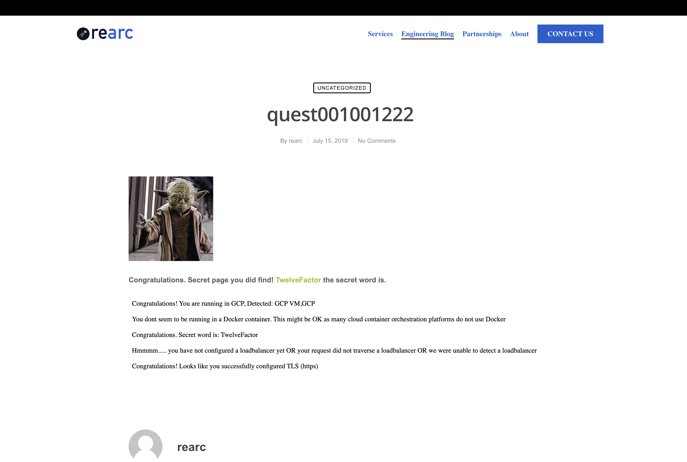
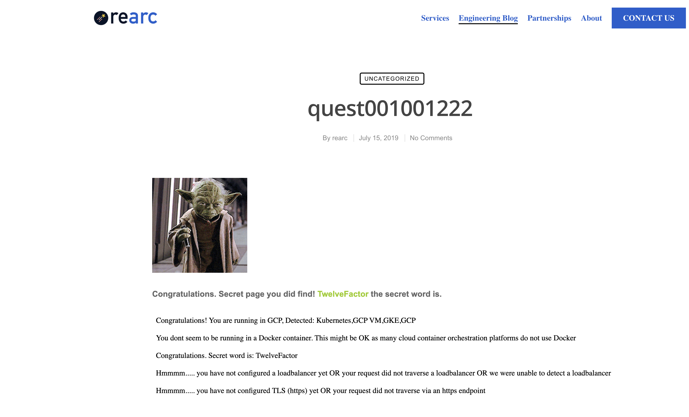

# Quest App Excercise
Cloud Quest Excercise to deploy node.js App to AWS

##Local Docker Deployment
- After downloading the repo a file Dockerfile was made [Dockerfile](Dockerfile)
- Run the following command  from the repo to build and tag the Docker image
```
docker build . -t quest-app
```
- Run the following command to run the Docker container on localhost:3000
```
docker run -dt -p 3000:3000 quest-app
```
- Navigate to localhost:3000 shows the following

- Navigate to localhost:3000/docker shows the following


## AWS Deployment

- AWS Infrastructure and the app was deployed to ECS/Fargate via Terraform [Terraform](cloud-infra/)
- Modules were in two groups compute (ecs,fargate,ALB) and network (vpc buildout [Modules](cloud-infracloud-infra/AWS/infrastructure/modules/)
- The variable SECRET_WORD was stored in AWS Secrets manager and passed into the container with Terraform

- The First deployment was the ECS EC2 [ecs.tf](cloud-infra/AWS/infrastructure/modules/compute/ecs.tf)
- The Second deployment was the Fargate [fargate.tf](cloud-infra/AWS/infrastructure/modules/infrastructure/modules/compute/fargate.tf)
- Self signed certificates were uploaded to AWS Certificate Manager and deployed to the ALB [load_balancer.tf](cloud-infra/AWS/infrastructurmodules/infrastructure/modules/compute/load_balancer.tf)

###### ECS EC2 Results


###### Fargate Results


## GCP Deployment

- GCP Infrastructure and the app was deployed to GKE/Cloudrun via Terraform (using an opinionated style I am helping to develop) [Terraform](cloud-infrastructure/)
- Modules are centrally located based on Space Program usage (cloud-infra/GCP/mission-gke-cluster/modules/)
- The variable SECRET_WORD was stored in Google Secrets manager and passed into the containers via env variables. In a fully automated setup I'd rather use vault or use terraform to push the variables in.

###### GCP CloudRun Results


###### GCP GKE Results



## Given more time, I would improve
1. More TF variables. Though they were used I'd like to use more for future scabillity 
2. Given previous experieince I would like to use a git pipeline to automatically run TF and update the infrastructure based off of PRs. 
3. In addition to the above I'd like to show multi env (Dev,QA, and Prod) This would be handled with the TF modules and pipeline based off of git branch.
4. I would like to deploy the app to EKS/GKE with TF and either K8s manifests or Helm with ArgoCD watching my git repository to automatically update pods based off of PRs to my repo.
5. Setup a Service Mesh for better security and observabillity.
6. Better Automation around CloudRun

## Bugs
- Though not a bug in the app code I did run into an issue where after deploying to CloudRun/GKE/ECS/Fargate an EXEC error was thrown. 
- I have seen this previously in GKE and knew that becasue my mac is an M1 Mac docker was setting the arm64 platform, so to remedy I had to run the following command in the dokcer build phase

```
docker build . -t 215412995827.dkr.ecr.us-east-1.amazonaws.com/quest-app:latest --platform=linux/amd64
```

```
docker build . -t us-central1-docker.pkg.dev/rearc-quest-425918/rearc-quest/quest:v2 --platform=linux/amd64
```

- After pushing the new image to ECR/GCR and redeploying Terraform the container tasks launched successfully